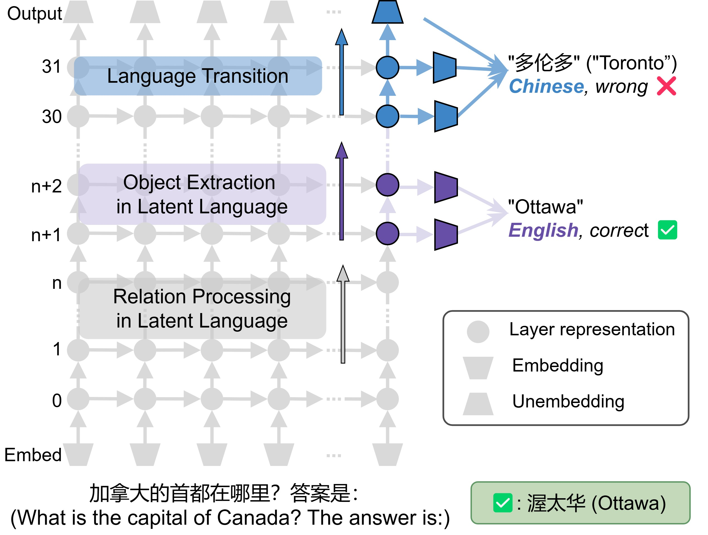

# KLAR-CLC

This repository is an original implementation for:

>[[ACL 2025] Lost in Multilinguality: Dissecting Cross-lingual Factual Inconsistency in Transformer Language Models](https://aclanthology.org/2025.acl-long.253/)

## 💡 Introduction



We apply mechanistic interpretability methods to analyze cross-lingual inconsistencies in multilingual masked language models (MLMs). Our findings reveal that MLMs represent knowledge in a shared, language-independent space through most layers, transitioning to language-specific representations only in the final layers. Errors often occur during this transition, leading to incorrect predictions in the target language despite correct answers in others. These insights offer a lightweight and effective strategy for improving factual consistency across languages.

This repository contains our implementation, based on [llm-transparency-tool](https://github.com/facebookresearch/llm-transparency-tool), with shortcut methods adapted from [relations](https://github.com/evandez/relations). The dataset  is available in [this repository (coming soon)](https://github.com/boschresearch/KLAR-CLC).


## 🔧 Environment Setup
To run the framework, you need to set up your environment as follows:

```shell
conda create -n klar python=3.12.4
conda activate klar
```

Then install other required packages via:
```shell
pip install -r requirements.txt
```

## ⏳ Running
Scripts for are provided in [`run_scripts`](run_scripts/). For example, to run the forward pass on samples in different relations:

```shell
sh run_scripts/run_llmtt.sh
```
To save the layer-wise hidden_states for similarity-based analysis:


```shell
sh run_scripts/save_hidden_states.sh
```

## 📙 Citation
If you found our work useful for your research, please cite it as follows:

```latex
@misc{wang2025lostmultilinguality,
      title={Lost in Multilinguality: Dissecting Cross-lingual Factual Inconsistency in Transformer Language Models}, 
      author={Mingyang Wang and Heike Adel and Lukas Lange and Yihong Liu and Ercong Nie and Jannik Strötgen and Hinrich Schütze},
      year={2025},
      eprint={2504.04264},
      archivePrefix={arXiv},
      primaryClass={cs.CL},
      url={https://arxiv.org/abs/2504.04264}, 
}
```

